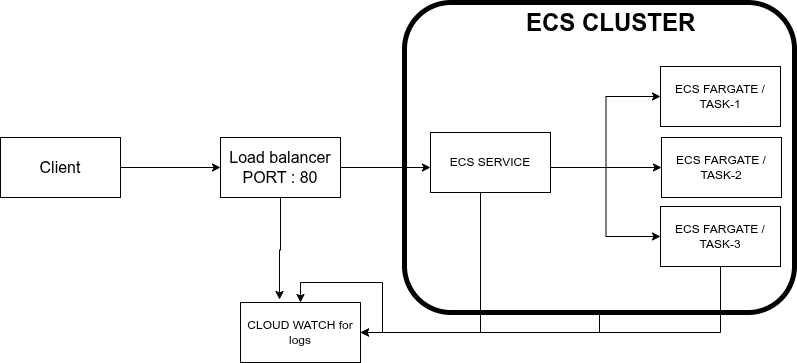

# CI/CD Pipeline with Terraform – AWS Infrastructure

## Architecture Diagram


## GitHub Actions – CI/CD Setup

* Add the following secrets in your GitHub repository:
  | Secret Name                | Description            |
  | -------------------------- | ---------------------- |
  | `AWS_ACCESS_KEY_ID`        | AWS Access Key         |
  | `AWS_SECRET_ACCESS_KEY`    | AWS Secret Key         |
  | `AWS_REGION`               | AWS Region             |
  | `ACTOR_DOCKER_HUB`         | DockerHub Username     |
  | `DEV_NAMESPACE_DOCKER_HUB` | DockerHub Namespace    |
  | `RELEASE_DOCKER_HUB`       | DockerHub Access Token |
* Update ECS cluster and service name in `push-trigger.yaml`

## Infrastructure as Code (Terraform)

### Prerequisites

* Install Terraform CLI
* Configure the following environment variables:
  ```
  export AWS_ACCESS_KEY_ID=your_key
  export AWS_SECRET_ACCESS_KEY=your_secret
  export AWS_REGION=your_region
  ```
* Ensure AWS IAM user has sufficient permissions.
* Verify DockerHub credentials before running pipelines.

### Terraform Deployment Steps

* Navigate to Terraform Directory
  ```
  cd ./terraform
  ```
* Initialize Terraform
  ```
  terraform init
  ```
* Update the `values.tfvars` file as per your infrastructure needs.
* Plan the Changes
  ```
  terraform plan -var-file=./values.tfvar
  ```
* Apply the Changes
  ```
  terraform apply -var-file=./values.tfvar
  ```
